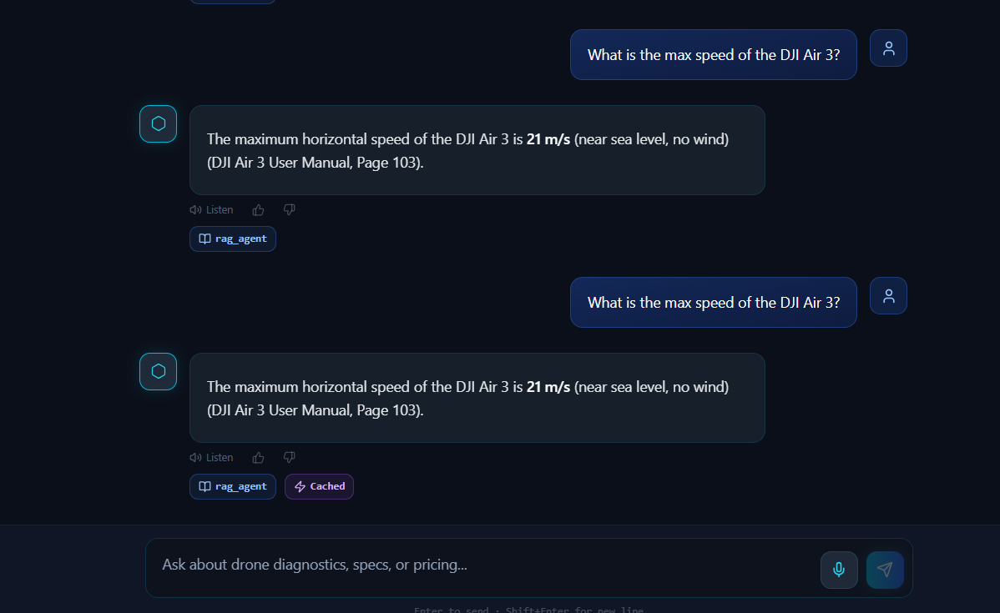
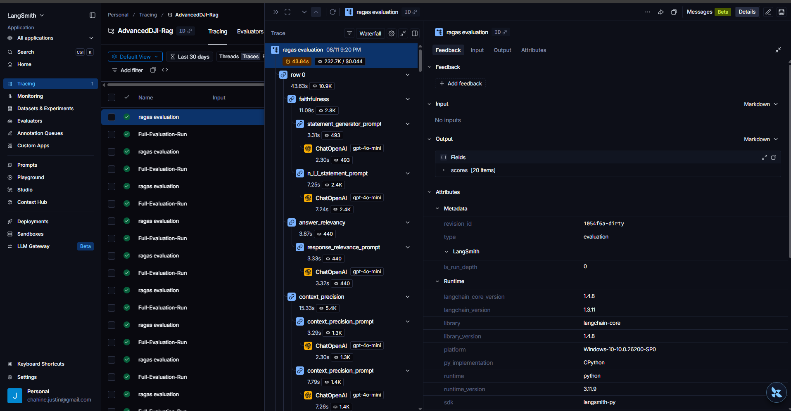
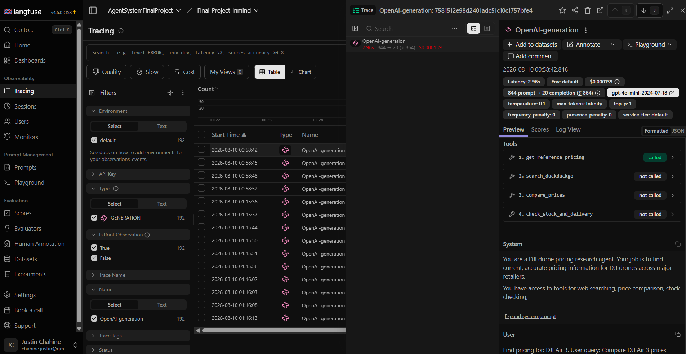
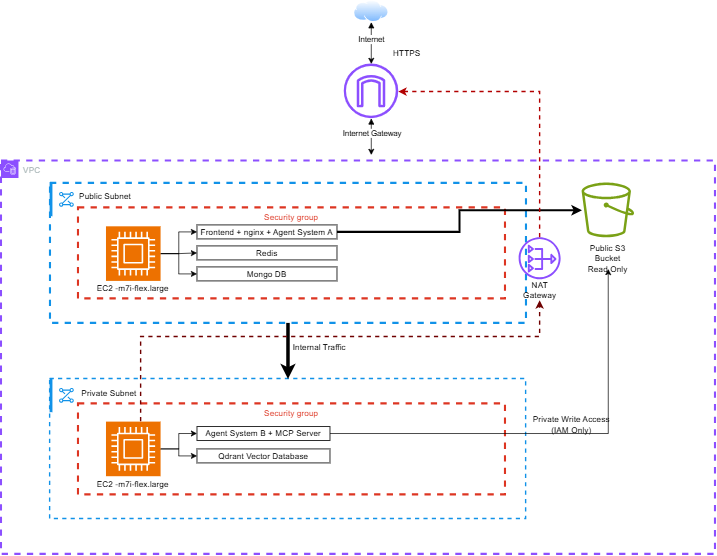

# DJI FlightControl AI

A production-ready multi-agent AI system for DJI drone support. Handles technical questions, diagnostics, pricing research, and tutorial discovery across multiple DJI drone models using RAG, LLM orchestration, and distributed microservices.

---

## Architecture

### System Overview


*Complete LangGraph workflow showing security checks, classification, routing, and specialist agents*

### Infrastructure Components

```
┌─────────────────────────────────────────────────────────────────────────────────┐
│                              USER (Browser)                                      │
│                                   │                                             │
│                              port 80 (HTTP)                                     │
└───────────────────────────────────┼─────────────────────────────────────────────┘
                                    │
┌───────────────────────────────────▼─────────────────────────────────────────────┐
│  FRONTEND (nginx + React/Vite)                                                  │
│  Proxies /api/* to Agent System A                                               │
└───────────────────────────────────┼─────────────────────────────────────────────┘
                                    │
┌───────────────────────────────────▼─────────────────────────────────────────────┐
│  AGENT SYSTEM A — LangGraph Orchestrator (port 8000)                            │
│                                                                                 │
│  ┌──────────┐   ┌──────────┐   ┌────────────┐   ┌─────────────┐               │
│  │JWT Auth  │──▶│Rate Limit│──▶│Semantic    │──▶│ LangGraph   │               │
│  │          │   │(Redis)   │   │Cache(Redis)│   │ Pipeline    │               │
│  └──────────┘   └──────────┘   └────────────┘   └──────┬──────┘               │
│                                                         │                       │
│  ┌──────────────────────────────────────────────────────┼──────────────────┐   │
│  │                    LangGraph Pipeline                 │                  │   │
│  │                                                      ▼                  │   │
│  │  Input Guard ──▶ BERT Classifier ──▶ LLM Supervisor ──▶ Multi-Router   │   │
│  │                                                           │             │   │
│  │                              ┌────────────┬───────────┬───┴──────┐      │   │
│  │                              ▼            ▼           ▼          ▼      │   │
│  │                         RAG Agent   Diagnostic   Pricing    Tutorial    │   │
│  │                              │        Agent       Agent      Agent      │   │
│  │                              └────────────┴───────────┴──────────┘      │   │
│  │                                           │                             │   │
│  │                                    Summarizer + Output Guard             │   │
│  └─────────────────────────────────────────────────────────────────────────┘   │
│                     │                                    │                       │
└─────────────────────┼────────────────────────────────────┼──────────────────────┘
                      │ HTTP                               │ HTTP
          ┌───────────▼──────────┐             ┌───────────▼──────────┐
          │  MCP SERVER (8002)   │             │  AGENT SYSTEM B      │
          │                      │             │  (port 8001)         │
          │  Tools:              │             │                      │
          │  • Vector Search     │             │  ReAct LLM Agent:    │
          │  • Error Code Lookup │             │  • Pricing (SerpAPI) │
          │  • PDF Ingestion     │             │  • Tutorials (YT)    │
          └──────────┬───────────┘             └──────────────────────┘
                     │
       ┌─────────────┼─────────────┐
       ▼             ▼             ▼
  ┌─────────┐  ┌─────────┐  ┌─────────┐
  │ Qdrant  │  │  Redis   │  │ MongoDB │
  │(Vectors)│  │ (Cache)  │  │(Convos) │
  └─────────┘  └─────────┘  └─────────┘
```

**Key Features:**
- **Input Guard**: LLM-powered security checks (prompt injection, jailbreak detection)
- **BERT Fast-Path**: 50ms classification (toggleable via UI)
- **Multi-Router**: Handles queries spanning multiple domains (e.g., "specs AND pricing")
- **4 Specialist Agents**: RAG (technical), Diagnostic (errors), Pricing (web), Tutorial (YouTube)
- **Output Guard**: Hallucination filtering before response

*Full pipeline documentation with state schema and example traces: [services/agent-system-a/AGENT_GRAPH.md](services/agent-system-a/AGENT_GRAPH.md)*

---

## System Demo


*Frontend interface showing multi-agent response with semantic cache hit indicator*

---

## Observability & Monitoring

### LangSmith Tracing

*Real-time trace visualization showing agent execution flow, token usage, and latency metrics*

### LangFuse Analytics

*Cost tracking, model performance metrics, and conversation analytics*

---

## AWS Deployment Architecture



**Infrastructure Components:**
- **EC2 Instance** (t3.medium): Hosts all Docker containers
- **Elastic IP**: Static public IP for domain mapping
- **S3 Bucket**: Stores uploaded PDF images and extracted content
- **Security Groups**: Configured for ports 80 (HTTP), 8000 (API), SSH
- **IAM Roles**: Service credentials for S3 access
- **Docker Compose**: Manages 7 containers across 2 networks
  - Frontend (nginx + React)
  - Agent System A (LangGraph orchestrator)
  - Agent System B (ReAct pricing/tutorial agent)
  - MCP Server (tool server)
  - Qdrant (vector database)
  - Redis (cache layer)
  - MongoDB (conversation storage)

**CI/CD Pipeline:**
- GitHub Actions workflow triggers on `push` to `main`
- SSH into EC2, pulls latest code, rebuilds containers
- Zero-downtime deployment using Docker Compose rolling updates

---

## What It Does

- **RAG Agent** — Answers technical questions using parent-child hybrid retrieval over DJI drone manuals (dense + BM25 + cross-encoder reranking)
- **Diagnostic Agent** — Looks up error codes and searches manuals for troubleshooting steps
- **Pricing Agent** — Researches current pricing across retailers via an autonomous ReAct agent with web search
- **Tutorial Agent** — Finds relevant YouTube tutorial videos for how-to questions
- **Multi-Route** — Handles complex queries spanning multiple domains (e.g., "what's the weight AND error code E001?")
- **Voice Input** — Whisper STT for voice-to-text, browser TTS for spoken responses
- **Admin Panel** — Ingest/delete PDFs, view feedback analytics

---

## Tech Stack

| Layer | Technology |
|-------|-----------|
| Frontend | React 18 + TypeScript + Vite + TailwindCSS + shadcn/ui |
| Agent System A | Python + LangGraph + FastAPI |
| Agent System B | Python + OpenAI Function Calling + FastAPI |
| MCP Server | Python + FastMCP + FastAPI |
| Vector DB | Qdrant (parent-child collections) |
| Embedding | OpenAI text-embedding-3-small (1536 dims) |
| Reranker | BAAI/bge-reranker-base (CrossEncoder) |
| Classifier | DistilBERT fine-tuned (300 samples, 100% accuracy) |
| LLM | GPT-4o-mini (routing, planning, generation) |
| Cache | Redis (semantic response cache + chunk cache) |
| Database | MongoDB (conversations, users, feedback) |
| Auth | JWT (user + admin roles) |
| Containerization | Docker + Docker Compose |
| CI/CD | GitHub Actions (SSH deploy) |

---

## Quick Start

### Prerequisites

- Docker & Docker Compose
- OpenAI API key
- (Optional) SerpAPI key for pricing/tutorials
- (Optional) AWS credentials for S3 image storage

### 1. Clone and configure

```bash
git clone https://github.com/your-username/Final_Project_Inmind.git
cd Final_Project_Inmind
cp .env.example .env
# Edit .env with your API keys
```

### 2. Train BERT classifier (optional, falls back to LLM if skipped)

```bash
python3 -m venv venv && source venv/bin/activate
pip install transformers torch scikit-learn accelerate datasets
python scripts/train_bert_classifier.py
```

### 3. Run with Docker Compose

```bash
docker compose up --build -d
```

### 4. Access

- **Frontend**: http://localhost (port 80)
- **Agent System A API**: http://localhost:8000/docs
- **Agent System B API**: http://localhost:8001/docs
- **MCP Server API**: http://localhost:8002/docs

### 5. First-time setup

1. Register an admin account via the frontend
2. Ingest DJI drone PDFs via the Admin panel
3. Start chatting

---

## Project Structure

```
├── docker-compose.yml              # Orchestrates all services
├── .env.example                    # Environment variable template
├── .github/workflows/deploy.yml    # CI/CD pipeline
├── frontend-v2/                    # React frontend
│   ├── Dockerfile
│   ├── nginx.conf
│   └── src/
├── services/
│   ├── agent-system-a/             # Primary LangGraph orchestrator
│   │   ├── Dockerfile
│   │   ├── main.py
│   │   └── src/
│   │       ├── agents/             # RAG, Diagnostic, Pricing, Tutorial
│   │       ├── pipeline/           # Guards, Classifier, Supervisor, Cache
│   │       ├── middleware/         # Rate Limiter, Circuit Breaker
│   │       ├── graph/              # LangGraph workflow + nodes
│   │       ├── auth/               # JWT authentication
│   │       └── db/                 # MongoDB persistence
│   ├── agent-system-b/             # ReAct pricing + tutorial agent
│   │   ├── Dockerfile
│   │   ├── main.py
│   │   └── src/
│   └── mcp-server/                 # MCP tool server
│       ├── Dockerfile
│       ├── server.py
│       └── tools/                  # Retrieval, Error Codes, Ingestion
├── models/
│   └── bert_intent_classifier/     # Fine-tuned DistilBERT
├── scripts/
│   └── train_bert_classifier.py
├── data/
│   ├── error_codes.json
│   └── ground_truth_qa.json
├── report/
│   ├── report.tex
│   └── presentation.tex
├── EVALUATION.md
├── FAILURE_CASES.md
├── DEVOPS.md
└── SUMMARY.md (in agent-system-a)
```

---

## Technical Decisions

| Decision | Justification |
|----------|--------------|
| **Parent-child chunking (1500/300)** | Small children embed precisely for search; large parents give LLM full context. Prevents hallucination from fragments. Best retrieval metrics in testing (F1: 0.958). |
| **text-embedding-3-small** | Best cost/quality ratio for English technical docs. 1536 dims sufficient for our corpus size. |
| **BERT as fast pre-router** | Saves ~2s + API cost per query by skipping LLM supervisor for 85%+ of queries. 100% accuracy on test set. |
| **Hybrid search (dense + BM25)** | BM25 catches exact keyword matches (model names, acronyms) that embeddings miss. Combined with reranker, gives best-of-both. |
| **bge-reranker-base** | 12-layer cross-encoder significantly outperformed MiniLM-L-6 (precision: 0.81→0.92). Worth the 200ms latency for accuracy. |
| **Two-tier caching** | Agent cache (full responses) + MCP cache (chunks). Different granularities catch different reuse patterns. |
| **Circuit breaker** | Prevents cascading failures when MCP/Agent-B is down. Fail-fast with graceful messages. |
| **HTTP between services** | Simulates real production distributed systems. Services independently deployable and testable. |
| **Plan-and-execute (System A) vs ReAct (System B)** | RAG has predictable patterns (plan once, execute). Pricing needs iterative reasoning (search, evaluate, search again). |

---

## Evaluation Summary

| Metric | Score | Config |
|--------|-------|--------|
| Faithfulness | 0.958 | Parent-child + hybrid + bge-reranker |
| Answer Relevancy | 0.922 | top_k=4, gpt-4o-mini, temp=0.2 |
| Context Precision | 0.936 | Hybrid search + reranking |
| Context Recall | 0.933 | BM25 + dense retrieval |
| BERT Routing Accuracy | 100% | 300 training samples |
| Agent Routing Accuracy | 100% | 30 test queries |

See `EVALUATION.md` for full metrics, `test.md` for experiment logs, and `FAILURE_CASES.md` for documented failures with root cause analysis.

---

## Known Limitations

1. **Pricing data** — depends on SerpAPI availability. Falls back to reference data for 3 main models.
2. **PDF ingestion** — S3 upload can timeout on slow connections. Images are optional.
3. **BERT classifier** — trained on 3 classes only. Novel intents (e.g., "tutorial") fall to LLM supervisor.
4. **Single-pass routing** — BERT fast-path picks one agent. Multi-route only triggers on low confidence or detected multi-domain patterns.
5. **No long-term memory** — system uses last 4 messages for context. Doesn't remember facts across conversations.

---

## Production Features

- JWT authentication (user + admin roles)
- Per-user rate limiting (20 req/min, Redis)
- Circuit breaker (3 failures → 30s cooldown)
- Input guard (Prompt Guard / LLM safety check)
- Output guard (hallucination filtering)
- Semantic response caching (cosine > 0.92)
- SSE streaming endpoint
- Voice input (Whisper STT) + TTS output
- Feedback system (thumbs up/down + admin dashboard)
- Query rewriting on retrieval failure
- Multi-route support for complex queries
- Docker Compose orchestration (7 containers, 2 networks)
- CI/CD auto-deploy via GitHub Actions

---

## Author

Justin Chahine — InMind AI/ML Track, August 2026
